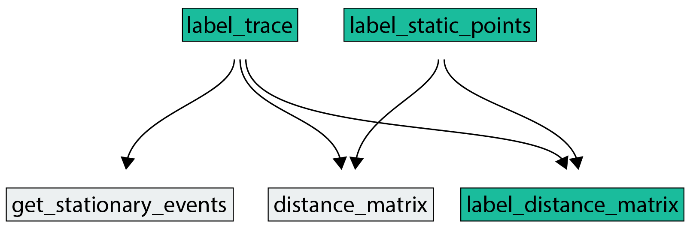
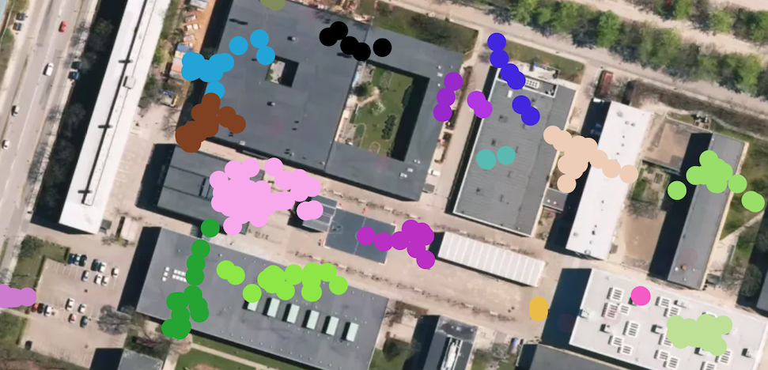

# Summary

Understanding human mobility is of great interest to scientists in multiple fields. While most mobility data is given as a time-series of GPS coordinates, e.g. collected from a smartphone, often the unit of greatest interest to researchers is the series of places that an individual visited—so called *places of interest* or *stop locations*. To detect stop locations a number of challenges must be overcome. First, the raw data is typically huge, requiring often some sort of downsampling pass over the collection to reduce the volumn at minimal signal expense. Second, and most difficult, the remaining coordinates must be clustered. There exists a number of methods for doing this [@Gong2015, @Cao2010, @montoliu2010discovering, @do2013places, @wan2013life, @zhao2015stop], but none deal with the fact that the coordinate clusters can be overlapping. For example, if an individual frequently stops at two separate locations that are near each other (e.g. adjacent buildings on a campus) location measurements from all visits should fall into two separate clusters; however, due to sampling noise they may overlap. Clustering algorithms that operate in euclidean space, such as DBSCAN [@ester1996density] or other agglomerative clustering methods are not well suited for this problem as anything that overlaps tend to get merged.

To allow for detection of overlapping clusters, Infostop treats the coordinates as nodes in a network and constructs links based on a distance threshold. It then clusters, or finds *communities*, in this network using the Infomap algorithm. Infomap is a flowbased network clustering algorithm, which assigns seperate labels to every pocket of nodes that constrain mobility of a random walker traversing the network. In this network representation, if two locations are close to each other, and their samples slightly overlap, the number links connecting within-location samples will vastly outnumber the number of links connecting between-location samples. Individual stop locations, although close, will therefore capture the random walker and earn a separate cluster label.

# Usage

Infostop has three functions designed for the user (see Fig. 1).

1. `label_trace`: **Given a time-ordered sequence of location measurements from one individual, assign stop location labels to each measurements.** (a) Using `get_stationary_events` detect which points are stationary and store only the median (lat, lon) of each stationarity event. A point belongs to a stationarity event if it is less than `r1` meters away from the median of the time-previous collection of stationary points. (b) Using `distance_matrix` compute the pairwise distances between all stationarity event medians. (c) Using `label_distance_matrix`, construct a network that links nodes (i.e. event medians) which are closer than `r2`. Assign a cluster label to each node using the Infomap algorithm, and map those labels back onto the input sequence. If input measurements are non-stationary, they are assigned the label *-1*. Optionally, also assign label *-1* to locations only visited once.
2. `label_static_points`: **Given a collection of locations points, assign cluster labels to each point.** It is assumes that points correspond to stationary location measurements; therefore Infostop only needs to execute steps 1.b-1.c.
3. `label_distance_matrix`: **Given a distance matrix, assign cluster labels to each point.** Here, the user already knows the distance matrix of the points they want to cluster, and Infostop therefore only executes step 1.c.

The default distance metric is the haversine distance, thus expecting the input location measurements to be (lat, lon) coordinates. However, the user can easily specify another distance function if they like. As such, Infostop—and in particular its `label_static_points` function—can be used as **a general clustering algorithm in any space that allows distance measurement between points**.

The user may also provide timestamps with the location measurements as a third column in the input array to the `label_trace` function and specify the parameters `min_staying_time` and `max_time_between`, to control first how long the individual should remain stationary for the event to count as stationary, and second what the maximum time between two consecutive location samples may be for them to fall into the same stationary event. This is highly useful if the time-resolution of the location data is variable.

Figure 2 visualizes a sample of labeled locations from an anonymous user on a university campus. Only the medians of each stationary location events are shown. It is apparant that many of the clusters are either very near or even overlap to some degree.

# Acknowledgements

U. A. developed the first version of the software, and L. A. contributed significantly in advancing the software. Both authors contributed equally to the documentation, and manuscript.

# References